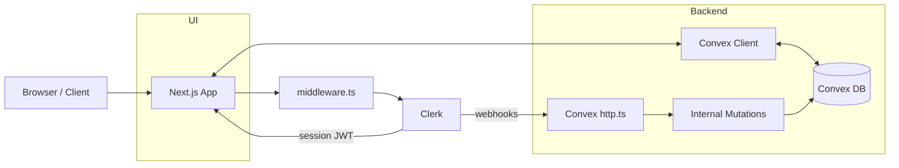

# Application Architecture

Concise overview of the app’s runtime layers, auth, data flow, webhooks, routing, and deployment.

## Overview

- Frontend: Next.js 15 (App Router, React 19), TailwindCSS v4, shadcn/ui, next-themes
- Auth & Billing: Clerk (sessions/UI), Clerk Billing (subscriptions)
- Backend: Convex (queries, mutations, real-time DB); Svix for webhook verification
- Languages/Type System: TypeScript throughout

## Key Modules & Structure

- app/
  - (landing)/ — public marketing and pricing
  - dashboard/ — protected area, includes payment-gated/
  - layout.tsx — providers & global UI
- middleware.ts — Clerk route protection
- components/ — UI primitives and CustomClerkPricing
- convex/
  - schema.ts — tables: users, paymentAttempts (+ indexes)
  - users.ts — upsert/delete via Clerk events; current user helpers
  - paymentAttemptTypes.ts — validators + transformWebhookData
  - paymentAttempts.ts — savePaymentAttempt mutation (links to users)
  - http.ts — webhook router, verifies Svix, invokes internal mutations

## Authentication & Authorization

- Clerk session established on sign-in; Next middleware enforces protection for /dashboard(.*)
- Clerk JWT template "convex" grants server-side identity for Convex
- Client calls to Convex use authenticated identity; sensitive mutations run server-side

## Data Access & Real-time

- Client components use Convex hooks (queries/mutations) for real-time sync
- Server mutations manage writes; indexes support efficient reads:
  - users.byExternalId, paymentAttempts.byPaymentId/byUserId/byPayerUserId

## Webhooks & Integrations

- Endpoint: POST /clerk-users-webhook (convex/http.ts)
  - user.created|updated → users.upsertFromClerk
  - user.deleted → users.deleteFromClerk
  - paymentAttempt.updated → paymentAttempts.savePaymentAttempt(transformWebhookData)
- Svix verifies signatures using CLERK_WEBHOOK_SECRET

## Routing

- Public: app/(landing)
- Protected: app/dashboard (middleware.ts → auth.protect)
- Subscription-only: app/dashboard/payment-gated (UI gates access based on billing status)

## Deployment & Env

- Deploy: Next.js → Vercel; Convex functions/data → Convex cloud
- Env (examples):
  - NEXT_PUBLIC_CLERK_PUBLISHABLE_KEY, CLERK_SECRET_KEY
  - NEXT_PUBLIC_CLERK_FRONTEND_API_URL, CLERK_WEBHOOK_SECRET
  - CONVEX_DEPLOYMENT, NEXT_PUBLIC_CONVEX_URL

## Architecture Diagram

